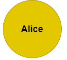

# How Crypto Works For The Non-Technical

## It's hard to explain

As a developer, I sort of understand how Crypto coins and Blockchains work under the covers. Blockchain, Hashes, Keys, Transactions, Blocks etc. I'm no expert!

Occasionally a friend will ask me what is Crypto (in the Bitcoin sense) and how does it work. I find it nearly impossible to describe in layman's terms. I sink into the technical details right away and they are lost. So this post is an attempt to put it into words that anyone can understand.

I am going to try to describe it in terms of physical objects and things people have to do. There is a lot more to the underlying technology and it gets complicated really fast. I have to skip a few of the nuances of the real technical issues but I think this gets the gist.

There will be some Magic happening in how this all works. Lets Go!

## The Things

There are three physical things in this Crypto world:

- Tokens (or Coin)
- Wallets
- Rigs

### Tokens

Assume a Token is a large gold colored coin. However it's not made of gold, its made of Unobtainium metal from the planet Crypton. Here are the attributes each coin has

- Each token has someone's name engraved on it. That indicates who owns the Token. Only one person can own a Token at a time.
- There are no identical names. If you are Bob but there is already a Bob who own Tokens, you have to come up with a different name.
- Tokens are indivisible, there are only whole tokens, no fractional parts. You can't break off a piece of a Token. Most real Crypto coins are divisible in some way, but to simplify lets say these Tokens are not.
- Other than the name engraved on the Token, they are all exactly the same.
- Tokens have **NO INTRINSIC VALUE**. For whatever reason, no one wants the metal for its own sake.
- Tokens are indestructable (Unobtanium, right?)
- The name on the token can only be changed by a special piece of equipment called a 'Rig'. Nothing else in the world can modify, damage, scratch or destroy a token.
- Tokens are created by Miners running Rigs. More on that below.

#### The Blockchain

Real Crypto systems use something called a Blockchain. I'm leaving that out. For this discussion, the fact that all Tokens have an indelible name engraved on them takes the place of a Blockchain. Its not exactly the same, but the bottom line is that if your name is on a Token, its yours. No matter where it is located or who physically has it. And once you name is on it, it can only be changed, with your explicit permission, by a Rig. That's more or less what a Blockchain does in real life.

Ok to get technical, a Blockchain, instead of engraving Tokens, is a digital file with a record of who owns what Token and a chronological record of all Transactions that occur. Because of how they are constructed, the records in a Blockchain can't be modified. Only new records can be added by legitimate transactions. Of course, the world isn't perfect and bad actors are constantly try to hack blockchains and the surrounding software. It pays to keep up with the news on Crypt you own.

### Wallets and Identification

Wallets are like a safe. Your name is stored in your Wallet. In this case not indelibly. You keep all your Tokens in a Wallet. You never leave them lying around. Wallets have a great big combination lock on them. Only you know the combination to unlock your own Wallet, and you don't know how to unlock anyone elses Wallet. Wallets are cheap and easy to get. All convenience stores sell wallets. Its no problem to get one.

You buy a Wallet and write your name in it. This becomes your ID. Now the magic of the Wallet is that you can use it to prove that you are you. That your name matches what is engraved on any Tokens you own. If your name is Bob and you inscribe Bob on your Wallet, then no one else can magically have the same name. You can use your Wallet to prove that any Tokens you own are really yours.

The name on your Wallet cannot be used by anyone else. Why not? In this case magic.

**Warning : If you lose your Wallet and the ID in it, you lose the ability to prove that you own the Tokens associated with the ID, and then those Tokens are effectively lost, because you can no longer prove its you who owns them. So don't lose it!**

### Rigs

A Rig is a device that is used to 'mine' Crypto Tokens, and to service Transactions.

- A Rig has two parts.
  - A large crank that can be turned by hand. The Rig only works when the crank is turning.
  - An engraving tool that only works on Unobtanium Tokens.
  <!-- prettier-ignore -->
- Anyone can buy a Rig for &#65284;100.
- All Rigs are identical
- There is no limit to the number of Rig's
- Rigs can do two things (when operated correctly)
  - Create new Tokens
  - Erase the current name on a Token and engrave a new name (also called a Transaction)
- Rigs communicate with other rigs by magic

In real Cryptocurrency it done with the magic of cryptography. Cryptography is a field of advanced mathematics that focuses on creating and keeping secrets. Trust me, it works. In real Cryptocurrency the Rigs communicate by the magic of the Internet and mathematical algorithms.

## The People

### Lookers

People who don't own Tokens or Rigs. They are just watching what happens. Lookers are not considered trustworthy.

### Owners

Owners are people who own Tokens. Owners are not considered trustworthy.

### Miners

Miners are people who own and operate Rigs. They are also Owners, at least part of the time, as will be explained. Unlike Lookers and Owners, Miners are Trustworthy. They will not do anything sketchy. If they did, their Rig would stop working and they would be marked for assassination by other Miners and Owners.

## Other Things

### Transactions

A Transaction occurs when one Owner transfers ownership of a Token to someone else. Usually for money or a service. To perform a Transaction, both parties go to a Miner and ask for the transfer. Before doing anything, the Miner will verify the identity of each party in a Transaction looking at their Wallets. The Miner then takes the Token to be transferred. and using the engraving tool on his Rig, wipes the name of the current owner and rewrites the name of the new owner.

It is customary to tip the Miner for handling the transaction. If you never tip, the Miners won't like you. They might not help you next time. This is usually called a Transaction Fee.

### Exchange

An Exchange is just a Looker who watches for Tokens to be created and Transactions to take place. When he sees one happen, he adds it to a display on their website. If its a new Token, he adds it to their count of how many tokens there are. If its Transaction, he updates the current price he is displaying. Otherwise he isn't a party to anything.
After things really get going, the Exchange also works like an Ebay for Tokens. Owners can list a Token for sale with an asking price. People who want to purchase a Token can see whats available and act on it. The Exchange can match up buyers and sellers and tell them how to meet up with a Miner to perform a Transaction.

## The Process

### How It Starts

At the beginning there are no Tokens and no Owners. Then a guy named Frank buys the first Rig and becomes a Miner. Frank goes to his new Rig and starts turning the crank. After a short period of time, bingo, a Token magically falls out of the Rig. Now Frank the Miner is also an Owner. He has the first Token with his name engraved on it. Whenever a Rig creates a Token, it is automatically engraved with the name 'Frank'.

Since Frank probably wants more Tokens, he keeps turning the crank. Then, at some point, a Looker named Bob comes up and says to the Miner, 'Hey I'll buy that Token for &#65284;1'. The Miner thinks about it for a bit, the agrees. Now, a Transaction needs to take place. Bob goes to Frank and hands over &#65284;1. Bob opens his Wallet (which he picked up from the local 7-11). The Miner looks at Bob's Wallet and sees Bob's name. The Miner then erases his name on the Token and writes 'Bob' on the Token. Frank hands over the Bob Token and Bob then locks his Wallet. Now Bob has a Token and Frank has &#65284;1.

So now there is one Owner and one Miner.

### Continuing On

All this time Frank has been turning the crank on his Rig and after a period of time it drops new Tokens. Frank notices it that each new Token takes a little longer and more crank turning to be created. This is important.

People start hearing about this new Token thing and more Transactions occur.

Bob describes his Token to another Looker named Alice. She thinks its really cool, and offers Bob &#65284;2 to buy his Token. Bob agrees. He tells Alice to go get a Wallet and give it the ID 'Alice'. Then they go to the Miner (who is still turning his crank to create more Tokens). Frank. Frank confirms that Bob is who he says he is, by checking the Wallet ID with the name on the Token. Frank takes the money from Alice and also takes a Token out of Bob's Wallet. He asks if they both want to proceed. If yes, he erases 'Bob' and writes 'Alice' on it and deposits in Alice's Wallet, and hands Bob the money. But since Frank the Miner is doing all the work, he expects to be compensated, so either Bob or Alice need to pay them a Transaction fee. The Transaction fee is small enough that it is worthwhile for Bob and Alice to pay it. Frank the Miner doesn't care why people are exchanging Tokens and &#65284; and doesn't ask. He just banks his fee and keeps turning the crank.

#### Aside on Services

Many Crypto types support exchanging Tokens for services instead of &#65284;. (called Smart Contracts) That gets a bit more complicated because either the service is done first or the buyer pays in advance. These Crypto types have mechanisms to make sure everything is done right, the service is performed and the Token is transferred. But for this discussion, ignore that and assume that all transactions are done with &#65284; and Tokens.

#### Aside on Miners

An important thing to note is that the Miner must keep turning the crank while he does the engraving. Miners pretty much have to keep turning the crank at all times. Never stopping. For two reasons:

- Miners want to create more Tokens
- Miners who aren't turning their crank cannot perform Transactions. And if a Miner stops turning his crank, Owners will start to ignore them and pretty soon no one will go to them for Transactions. So they won't get any fees.

### An Exchange Pops Up

Pretty soon Dave sees that lots of Transactions are happening and that people are really interested in buying and selling Tokens. So Dave gets a web developer and starts up an Exchange. Dave does not have to be an Owner or Miner, he is really just a Looker displaying what is going on with the Tokens.

### More Miners

Joe has been watching the Exchange and figures there is an opportunity here, so he decides to become a Miner. He buys TWO Rigs and hires two employees whose job it is to turn the cranks and handle Transactions.

Now there are three Miners in the system. Owners can go to any one of them to perform a Transaction. And each Miner has an equal chance of creating the next new Token.

I mentioned that the time between creating new Tokens gets longer each time one is created. When a Miner creates a new Token, the other Rigs are magically informed of it and their timers are reset so that they take the same longer time to create the next new Token. Its totally random which Miner will create the next new Token. It's like a lottery where you keep buying tickets until you win. And that's turns into a lot of cranking.

Since the Miners have to work longer for each new Token, and because there is no guarantee they will even get the next one, they will keep mining it only as long as the value of the Tokens exceeds the value of the work they do.

## Everything Really Gets Going

After a few years, the news gets out about this new Crypto Token thing and more people start buying and selling Tokens. The demand for Tokens increases. In the meantime the rate of creating new Tokens gets longer and longer. Eventually the time between Token creation is so long that it takes days and months for new Tokens to be created. This turns into a perceived shortage of Tokens. Demand skyrockets. The price of buying a Token from an Owner goes up.

While that is happening, it starts to look attractive to be a Miner, since if you can create a new Token you can sell it for a lot. So lots of Rigs are purchased and more people are employed turning the cranks. Soon there are big organizations with hundreds of Rigs going. These Miners limp along by earning Transaction fees and make the big &#65284; when a new Token is created. Eventually there is a drain on resources to keep the employees who are turning the cranks from keeling over.

## So What?

### Value?

As was stated in the beginning, Tokens have no intrinsic value. The metal they are made from is useless for anything else. In real Crypto, there is nothing physical at all. Just a record on a Blockchain. The only value that Tokens have is based on supply and demand. The supply is intentionally limited. The demand is based on the utility of Tokens and how much people are willing to pay to buy one. Nothing else. Sounds no different than a Government controlled Fiat Currency. Or is it?

It turns out there are a few of features that make the Tokens different from a Fiat Currency.

(Here is a reasonable description why Bitcoins have value)[https://www.investopedia.com/ask/answers/100314/why-do-bitcoins-have-value.asp]

#### Anonymity

When a buyer purchases a Token, they give a name to be engrave on it. The buyer can use any name they want. So why give their own name. Why not a unique, long string of random characters. So they create a Wallet with that string and use it. Then no one can tell who owns the Token by looking at the name.

##### Side Effects

One side effect of this is that criminals like to use Crypto as a way of receiving money, sending it or moving it around.
Governments want their taxes though. Some places have stiff penalties for not reporting Crypto profits. Some countries may ban Crypto altogether. If you have access to the relevant data, it is possible to correlate conventional movement of money with a public Blockchain that records all Transactions, and thereby (at least) infer who is doing what. If Alice sold a Token for &#65284;100,000 and deposited the money in a conventional bank, some three letter agency might see both those transactions and connect the two together. Alice might get a visit she doesn't want.

#### Government Manipulation

Its widely known that Governments can manipulate their own fiat currency to artificially increase or decrease the supply of that currency at will. Either for economic or political purposes. Folks have to trust the Government to do the right thing. It doesn't always work out that way.

In a Crypto system, no one is in control of supply of Tokens. Its magically enforced by how mining works. So all you have to trust is the mechanism that creates tokens. Some real Crypto systems have a limit on how many Tokens will ever be created (BITCOIN). At some point their Rigs just stop creating new Tokens, preventing inflation.

#### Counterfeiting

Successful counterfeiters can dilute the value of a fiat currencies. The U.S. Dollar is always under attack by nation-state counterfeiting. A parallel in Crypto are hackers who continually try to find weaknesses in the algorithms and implementation of Blockchains, mining and transaction handling. So far Bitcoin has resisted these attacks. One thing to watch out for when owning particular crypt coins is whether their system is well proven.

Remember it is important that in our imaginary Crypto scheme, Miners are always trustworthy. (That may not work out in the real world)[https://www.investopedia.com/terms/1/51-attack.asp].

## What Is The Magic?

The magic used in this article really is about three things:

- The Mathematics of Cryptography
  - Cryptography is a field of advanced mathematics that focuses on creating and keeping secrets. Trust me, it works.
- Networks
  - In real Cryptocurrency the Mining Rigs communicate by the magic of the Internet.
- Software Algorithms
  - Since in real life communication over the Internet is not instantaneous, Cryptocurrency systems are powered by computer algorithms that create a Consensus between the Mining Rigs. They all (eventually) agree on who is who and who owns what coins.
