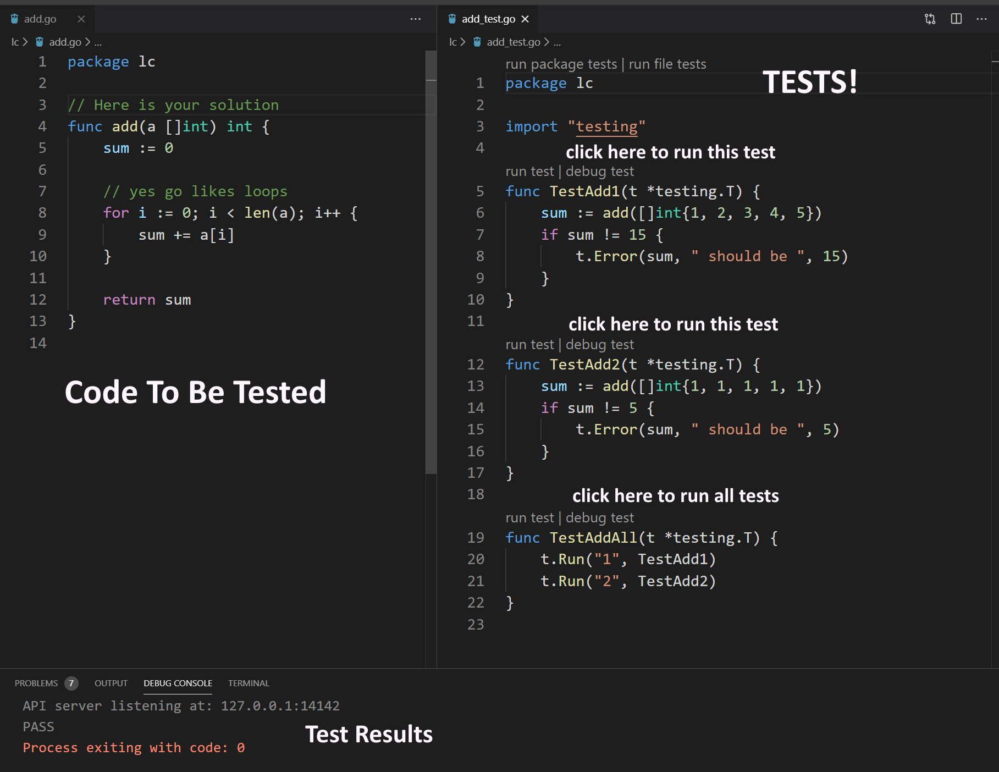

### Why I Use Go for Leetcode

I am not a LeetCode expert, although I have a few years of coding experience. 
I have about 80 accepted solutions, mostly easy. I do them for fun and learning.
Due to early mistakes in the process, my acceptance rate is only 39%.
That's terrible and it is because I would 'Submit' before I was ready.
Initially I used C++ for solving the problems but lately have 
switched to using Go. I find that using Go is very efficient. 

In my initial forays into LeetCode I used C++ because I was most familiar with it. Here are a few pros and cons (my opinion) for using C++:
- Pro C++
    - its a statically typed language. 
    - the standard library has extensive support for most of the data structures you will ever need. 
        - with the exception of the LeetCode Tree.
- Con C++
    - verbose
    - sometimes complicated syntax
    - edit-compile-run cycle has friction
        - even in Visual Studio, the cycle takes a flow-breaking delay.
    - difficult to run snippets without some setup and without having to change it to run a different one

#### My Process

First, let me outline a process for solving LeetCode problems
that I believe lead to better submission outcomes. I define
a good submission outcome to be one that works on the first
'Submit'. An ok one is two or three 'Submit's. Worst is a long string
 of submit errors because I lost discipline and was just trying things. 
 This kills your submission stats. If that matters, and its kind of funny that 
 it matters to me when no one else will ever care about or even see my stats. People
 are sometimes (usually?) their own harshest judge.
 Most errors on those submissions could have be avoided with a good process.

This may not lead to  getting to a working submission the quickest,
 but it will help your submission stats. No one will know if you 
 iterated on a problem 100 times before getting it to work. 

 (I exclude the geniuses who can just read the problem, visualize the code, type it in and submit)

1. Understand the problem
    - Sometimes I have done a cursory look at the problem, thought 'ok that's easy'and had mistakes because, well, I didn't actually know what the solution was actually supposed to do. 
    - be clear what the specs are for the inputs, like integer range, empty inputs ('[]'), length of allowed test cases. 
    - if a problem specifies it might have 10^8 items in a test case (I've seen that) you can be sure an N^2 solution won't pass.
    - on the other hand, just like its recommended for coding interviews, consider implementing a brute force solution first. You can run your test cases locally to see if your understanding of the problem makes sense. Then think about improving the O(?).
    - work it out on paper as if you were whiteboarding
2. Implement your solution offline
    - with the right tooling you can get to a working solution much faster than flailing on the LeetCode environment.
    - by working offline, you can experiment efficiently and build up a solution incrementally. 
3. Test locally all the given test cases and any others you can think of that would catch corner cases.
    - avoid all that  'pending', 'speedup', 'judging' wait.wait.wait...
    - of course testing catches mistakes. running the tests offline ensure you don't accidentally submit a non-working solution.
    - using an offline test fixture, you can create and execute an array of tests and run them all to detect regressions. You can only do one at a time on the LeetCode environment
    - if you have good tooling you can get this done efficiently.
4. When you think you have a solution, paste your working offline code into the LeetCode editor.
    - IF you make any change to your code right in the LeetCode editor, be sure to do a 'Run Code' pass so you don't get a submission fail due to a syntax error or typo.
5. Run the same testcases on the LeetCode environment before submitting.
    - Be sure your use the same test cases. Reenter the tests using the custom test case option, just in case you had a typo or mistake in your offline test cases.
6. Finally, when everything looks good, hit 'Submit'. 
    - if you keep up your discipline, most times it will fly
    - I never submit until my offline tests all work. if my submissions fail on the first try, its usually because there is a test case I didn't think of. So go back offline, implement the test case and try again.
    - the second reason my submissions might fail on a first try is a Timeout. Typically that happens if I do a quick naive solution that is N^2 (test all items in array A against all items in Array B) or worse N! (permutations and combinations).
7. Finally, when I get stuck after spending an hour on it, I go ahead and Google for a solution. 
    - Is LeetCode testing than you can crap out the Knuth-Morris-Pratt algorithm from scratch? JH Morris actually did that way back around 1970, but I expect he spent more than a couple of hours on it. Maybe not?
    - I treat LeetCode as a learning method so at some point a problem will be too tough. But when when you do use a known solution, work through the theory and try to implement it yourself. Don't copy/paste someone else's code. 
8. Finally, consider keeping your solutions in Github or the like. You may want to refer back someday.

One thing I have heard of is that some top experts actually compose a proof of their algorithm before submitting it. Those guys are simply geniuses. None of this applies to those folks.

#### Why Go?

The Go language has some warts and there are credible arguments about it. Just google 'is Go any good'.   I'm not here to argue one way or the other, at least in general. 

However, for LeetCode use, I find it worthy.  Let me say why. But first some recommendations for what helps in a selection of language platform for LeetCode. 

You want least-friction tooling.
- You want your edit-compile-run or edit-run cycle to be a one-click affair
- Avoiding a compile cycle reduces friction.
- dynamic languages like JavaScript and Python decrease friction
- verbose languages like C++ and Java increase friction
- long compile times increase friction
- its nice if you can edit..run right from your edit environment. Most tooling these days allows that. Some better than others.
- being able to run bits of code independently without having to hack a main function. Really helps with testing.
- having platform native test-fixture support is a win

Your language and its libraries for the LeetCode platform need to provide a few things so you don't have to reinvent the wheel. Of course
if your language doesn't have these, you can build them yourself and keep them handy. But
for those of us who are lazy, its nice if batteries are included:
- dynamic arrays
    - needed all the time for LeetCode problems
        - has push front/back, pop front/back and indexed access
        - Python lists, JavaScript arrays, C++ vectors, etc
        - can be inefficient if you have a lot of resizing, pushing, popping, slicing, etc. consider a linked list if you don't need indexed access.
- linked lists 
    - for efficient append/prepend and remove in the middle
    - if you need a queue or stack
- hash table 
    - unordered key/value store
    - needed all the time
- less important nice-to-have
    - heap 
    - generics
        - to make type safe collections
- functional-ness, avoids errors due to unintended mutations
    - Map,Reduce,Filter
    - non-mutability

##### LeetCode Trees
One thing LeetCode uses A LOT is a binary tree with their own node definition.
It can really help if you go ahead and create an implementation of building and
traversing a LeetCode TreeNode tree of your own. If you don't have this, you can't test offline. 
You need some code that lets you build a LeetCode TreeNode tree from an array of input to be able to test.
The appendix below has an implementation that I use.

## Using Go with LeetCode
After a break of not doing any LeetCode for a year, I jumped back in. I did this because I had started learning Go and 
I wanted to practice Go coding beyond the tutorials. I found that using Go with Visual Studio Code was a gigantic win 
applied to LeetCode. There is a reason VS Code has taken over the world. 

Here are some pros and cons. Not necessarily in comparison to other languages. 
Just in terms of Go with LeetCode. Here is a link that discusses the [the good, the bad, and the ugly](https://bluxte.net/musings/2018/04/10/go-good-bad-ugly/)

Pros of Go (for LeetCode):
- statically typed and type inference
    - supported by VS Code
    - VS Code makes typos and type mismatch obvious without having to run first.
    - for LeetCode purposes, statically typed languages prevent errors introduced by typos that would allow a dynamic language program to run but give unexpected results. At least, that's my opinion. A Python or JavaScript expert might disagree. It does introduce a bit of friction.
    - if you are in a hurry, you can use := to avoid extra work declaring variable types while maintaining static typing.
- mostly familiar structure
    - if you are used to C structured languages
- kind of simple for LeetCode purposes
    - going through the official golang.org tutorial is enough to learn it for LeetCode. 
    - once you figure out a couple of things.
        - slices
        - method sets
- not verbose
    - looks kind of like C++ with about half the keyboard clicking.
    - := lets you skip some declarations with type safety
- garbage collection
  - no need to manage memory as in C/C++
- has all the data structures listed above in its standard library.
    - dynamic arrays : slice
    - hash table : map
    - included but not type safe due to lack of generics.
        - doubly linked list : container/list
        - heap : colelctions/heap
    - not included
        - balanced trees : NO, doesn't have. probably don't need most of the time.
- native test framework
    - very easy to setup and run, doesn't require a main fixture. just write snippets using the test framework.
    - easy to run an entire test suite, automatically finds all the tests based on file and fucntion naming conventions
    - with VS code its easy to run individual test snippets with a single click.
    - the appendix has an example of what the Go test framework lets you do
- VS Code Integration
    - static typing and inference identifies many errors immediately
    - using the golang test framework and VSCode makes it frictionless to run test cases against the LeetCode problems.
    - instant feedback for syntax errors
    - builds are instantaneous for the size of LeetCode problems.

Cons of Go (For LeetCode):
- no Generics
    - really hurts in some situations
- := can shadow variables, creating weird results
- is it any better than other languages? yes, no, maybe. it depends.

Other stuff:
- does learning Go do you any good 
    - for jobs? maybe but probably not. it might be a plus on a resume (if  you can back it up)
    - for expanding your knowledge in general, yea
    - if it takes away time from relevant platforms?
- if you are a C,C++,Java,JavaScript,C# programmer you will find your fingers doing things wrong in Go
    - inserting extra parens
    - defining types in [type] [variable name] order. go is [name] [type] order.

#### Conclusion

I contend that for LeetCode use, Go the language is good enough. Not verbose, almost feels like a dynamic 
language but with static typing. Go has most of what you need. And with VSCode you get a very frictionless
coding experience.


#### Appendix 
<pre></pre>

##### 1. LeetCode Tree Utility

````go
// TreeNode ...
type TreeNode struct {
	Val   int
	Left  *TreeNode
	Right *TreeNode
}

func insertLevelOrder(arr []int, root *TreeNode, i int, n int) *TreeNode {
	// Base case for recursion
	if i >= n {
		return root
	}

    // NOTE : for empty nodes leetcode will 
    // use 'null' in the test spec [1,2,null,3,4]
    // This implementation substitutes -2147483648 for null
    // so an input slice would be [1,2,-2147483648,3,4] instead
    // terms with -2147483648 will be nil in the 
    // constructed tree. since this whole implementation is only used locally
    // it doesn't affect your solution.
	if arr[i] == -2147483648 {
		return nil
	}

	root = newNode(arr[i])

	// insert left child
	root.Left = insertLevelOrder(arr, root.Left, 2*i+1, n)

	// insert right child
	root.Right = insertLevelOrder(arr, root.Right, 2*i+2, n)

	return root
}

func inOrderF(node *TreeNode, f func(n *TreeNode)) {
	if node != nil {
		inOrder(node.Left)
		// Visit
		f(node)
		inOrder(node.Right)
	}
}

func preOrderF(node *TreeNode, f func(n *TreeNode)) {
	if node != nil {
		// Visit
		f(node)
		preOrder(node.Left)
		preOrder(node.Right)
	}
}

func postOrderF(node *TreeNode, f func(n *TreeNode)) {
	if node != nil {
		postOrder(node.Left)
		postOrder(node.Right)
		// Visit
		f(node)
	}
}

func newNode(v int) *TreeNode {
	return &TreeNode{Val: v, Left: nil, Right: nil}
}

func buildLeetCodeTree(a []int) *TreeNode {
	var root *TreeNode

	root = insertLevelOrder(a, root, 0, len(a))

	return root
}

/*
   inserts in LeetCode level order, not sorted order   
   
   input: 
     a := []int{1, 2, 3, 4, 5}

   tree structure:
	/*
               1
             /    \ 
           	/      \
           2        3
         /  \
       	4    5

	*/
*/
````

<pre></pre>
##### 1. VSCode + Go Test fixture

Go has a very simple native test fixture that is easy to use and fits right in 
for writing and testing snippets without a lot of setup. If your code is in 
tree.go, create a file tree_test.go, import "testing" and implement your tests.
Read all about it [here}(https://golang.org/pkg/testing/]

Here's an example of what it looks like and how it shows up in VSCode.
The cool thing is you can change a snippet then test it by clicking right
on the test file. (VSCode adds the run test | debug test buttons. They aren't in the source code)


